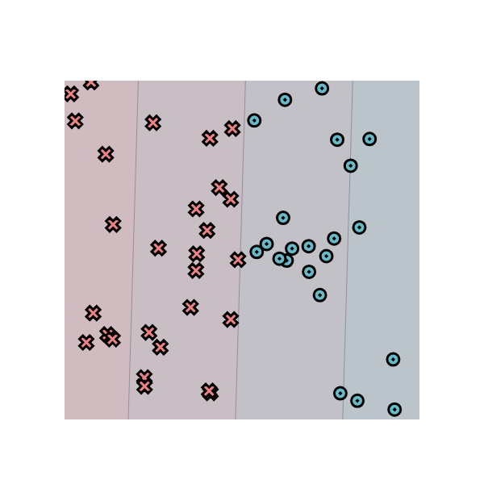

# MiniTorch Module 0

* Docs: https://minitorch.github.io/

* Overview: https://minitorch.github.io/module0/module0/

* Decision boundary for a simple linear classifier with weights $w=(-0.71, 0.02)$ and bias $b=0.32$)

